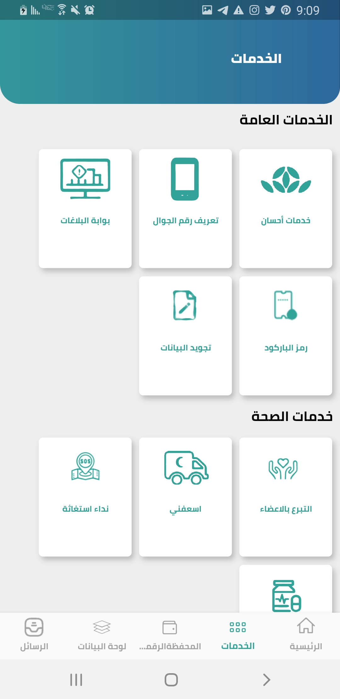
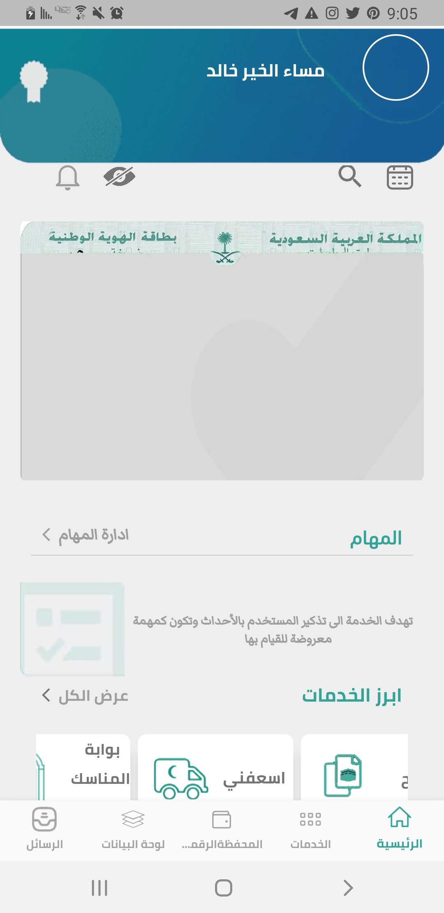
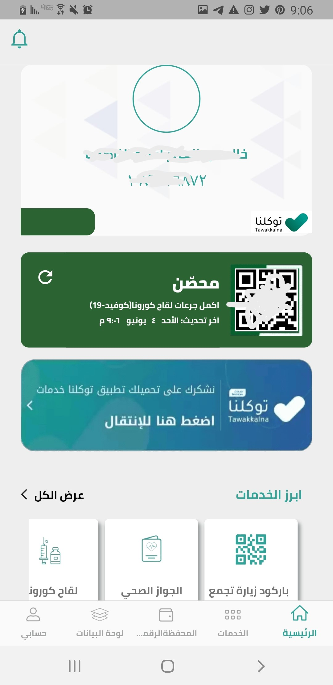
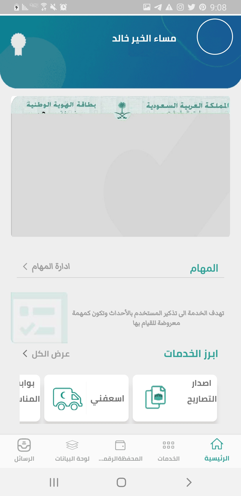
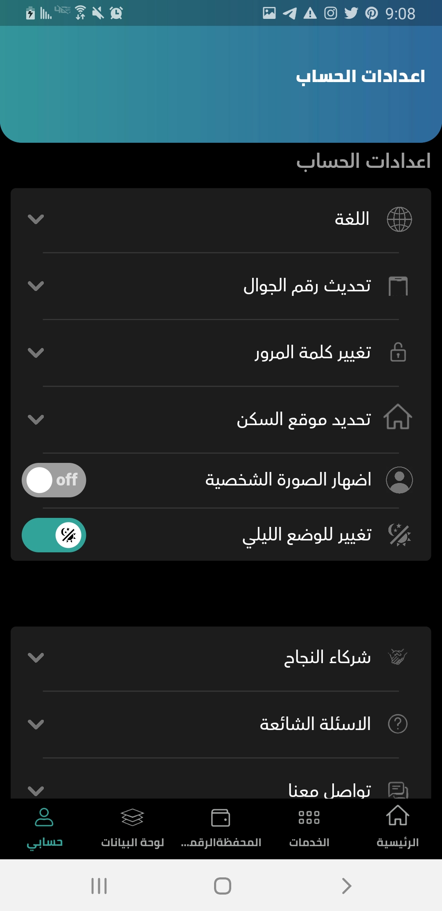
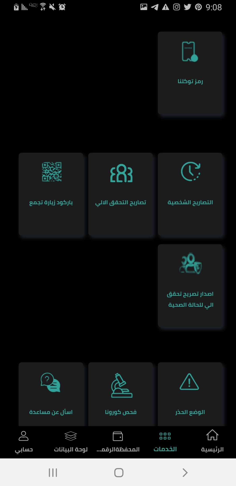

 <h1> مشروع تطبيق توكلنا بالكامل
</h1>

#

#

<h1 align="right"> توكلنا</h1>
 <h5 align="right"> 
 
 * هو تطبيق محمول وبرنامج كمبيوتر مصمم ليعمل على الهواتف الذكية، وأجهزة الكمبيوتر اللوحي وغيرها من الأجهزة النقالة. وهو واحد من التطبيقات الخاصة بوباء فيروس كورونا 2019–20 يقوم بإدارة عملية منح التصاريح إلكترونيًا خلال فترة منع التجول، والتطبيق مقدم من الهيئة السعودية للبيانات والذكاء الاصطناعي ويأتي في إطار دعم الجهود الحكومية للحد من انتشار فيروس «كورونا» المستجد. وقد تجاوز عدد مستخدميه 27 مليون مستفيد.
 </h5> 

<h2 align="left"> ScreenShot </h2>

 

<h2 align="left">ScreenShot Theme Dark</h2>

 

<h2 align="right"> خصائص التطبيق </h2>

<h4 align="right">

* طلب تصاريح الخروج للحصول على التموين الضروري خلال فترة المنع بشكل إلكتروني عن طريق التطبيق بحيث تتم معالجة الطلبات آليًا.
* طلب تصاريح التموين داخل الحي خلال فترة المنع الكلي بشكل إلكتروني عن طريق التطبيق بحيث تتم معالجة الطلبات آليًا.
* استعراض الكود الخاص بالمستخدم [[رمز استجابة سريعة|"QR"]] لرجل الأمن للإسهام في تسريع عملية التحقق والمرور للمواطنين والمقيمين.
* الإجابة عن الأسئلة الصحية لدعم وزارة الصحة في متابعة تلك الحالات، ويمكن التبليغ عن حالات الاشتباه وإيصال ذلك للجهات المعنية لمساعدة المستخدم على تلقي الخدمات الصحية، وبالتالي المساهمة في الحد من انتشار الفيروس.
* استعراض تصاريح العمل بشكل إلكتروني لتسهيل عملية انتقال موظفي الجهات الحكومية وشركات القطاع الخاص المستثناة من المنع، مثل: موظفي المستشفيات، والصيدليات، وشركات التموين، وغيرها من الجهات والشركات الحيوية، من وإلى مواقع عملهم، من خلال تمكين الجهات والمنشآت من رفع تصاريح العمل بشكل إلكتروني عبر تطبيق توكلنا.
* استعراض آخر المستجدات الصحية والطبية المتعلقة بانتشار الوباء وسبل الوقاية منه.
* عرض تصاريح المواعيد الطبية للمستخدم.
* طلب تغيير مكان الإقامة.
* إظهار العد التنازلي للوقت المتبقي للتصريح.
* إمكانية طلب تصريح إلحاقي للسائق الخاص.
* تنبيه المستخدم بعدد الساعات المتبقية من الرصيد.
* يعمل التطبيق باللغتين العربية والإنجليزية.

</h4>

<h2 align="right"> تطبيق توكلنا خدمات </h2>

<h5 align="right">

* أطلقت الهيئة السعودية للبيانات والذكاء الاصطناعي (سدايا) تطبيق «توكلنا خدمات» في 29 أبريل 2022 لتقديم أكثر من 140 خدمة إلكترونية في مكان واحد.
</h5>
<h5 align="right">

* ويشتمل تطبيق «توكلنا خدمات» الذي يُعدأحدالمنتجات النوعية لمنظومة توكلنا، على خدمة استعراض رخص القيادة والتأمين والجوازات والصكوك والوكالات، والمحفظة الرقمية المعتمدة لدى الجهات الحكومية، وخدمات الفعاليات والخدمات العامة، والتي تشمل التبرع مع إحسان وتجويد البيانات ورمز توكلنا وتعريف رقم الجوال، وغيرها من الخدمات

</h5>

<h2 align="right"> خدمات تطبيق توكلنا في ظل حالة المنع من التجوال</h2>

<h4 align="right"> 

* 1- استعراض المخالفات.
* 2- الاستعلام عن مخالفات شخص آخر.
* 3- طلب تصاريح التموين داخل الحي.
* 4- طلب تصاريح الخروج.
* 5- استعراض تصاريح العمل.
* 6- الإجابة عن الأسئلة الصحية لدعم وزارة الصحة في متابعة تلك الحالات.
* 7- استعراض الكود الخاص بالمستخدم "QR" لرجل الأمن.
* 8- استعراض آخر المستجدات الصحية والطبية.
* 9- إمكانية طلـب تـصريح إلحاقي للسائق الخاص.
* 10- عرض تصاريح المواعيد الطبية للمستخدم.
* 11- تصريح رياضة المشي ساعة واحدة في اليوم (داخل الحي).
* 12- تصريح طبي طارئ.
* 13 تصريح طالب.
* 14 بلاغ كسر منع التجول.<ref name=":0" />

</h4>

#

#
<h2></h2>

<h2 align="right"> لشراء نسخه من المشروع تواصل مع المطور </h2>
<h5 align="right">

 [`Telegram`](https://t.me/dev_b19) [`fecebook`](https://www.facebook.com/Devboss.YM) [`instagram`](https://www.instagram.com/Devboss.YM) [`WhatsApp`](https://wa.me/967772146656/?text=Hello,Dev)
#

</h5>
